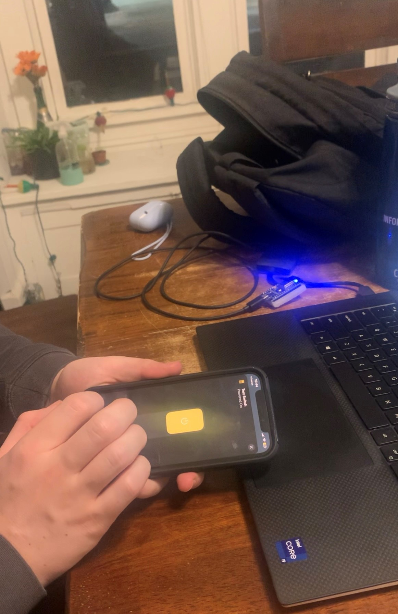
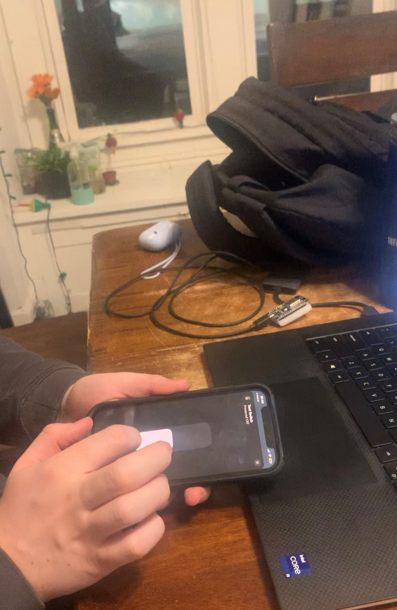
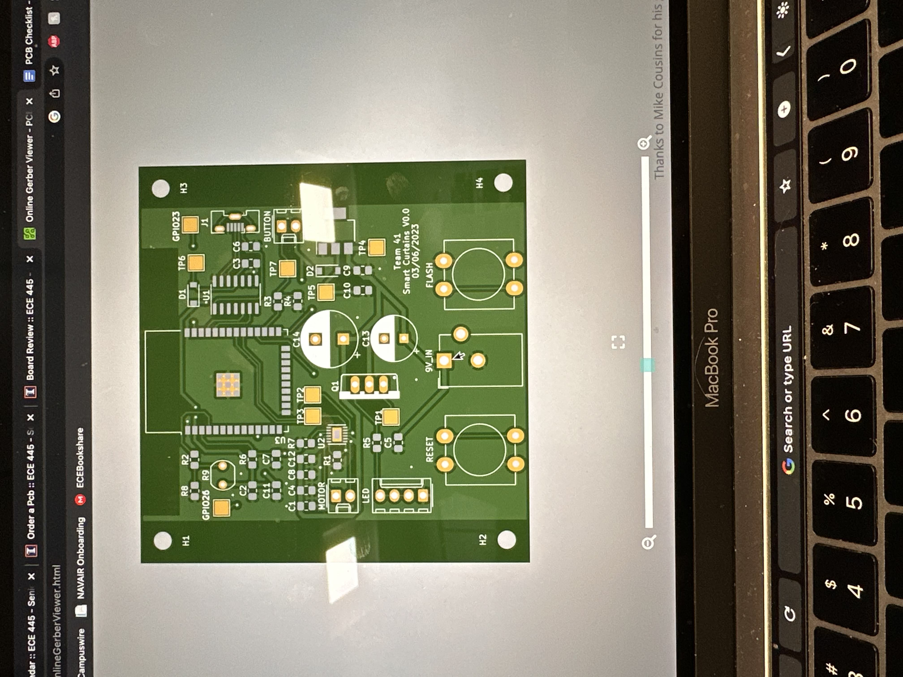
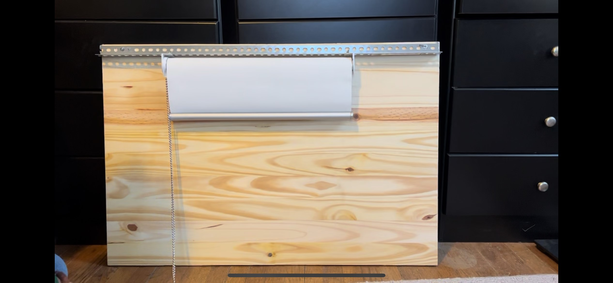
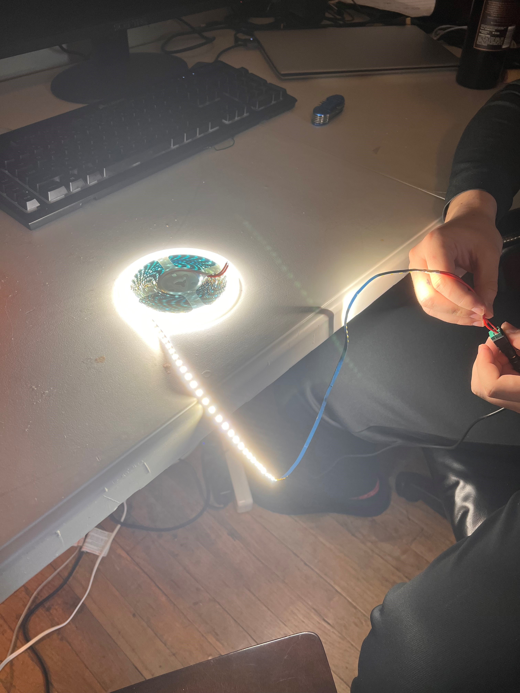

# Max Worklog

# 2023-02-07 - Proposal TA Meeting
-   It was suggested that voltages be put on block diagrams to ensure clarity in the design process.
-   Research on the HomeKit chip was discussed. A chip was needed that supports WIFI, HomeKit, and has enough I/O ports for other subsystems.
-   It was noted that we needed to determine the number of I/O ports that would be needed for the project.
-   It was emphasized that the chip should be given the correct power to avoid any potential issues.
-   Safety and tolerance analysis were discussed for proposal.
-   It was suggested that circuit diagrams should be started to provide a more detailed look at the system.
-  Need to get proposal submitted
-  Meet weekly Wednesday from 2-3pm

# 2023-02-15 - TA Meeting #1

  

-   The need to have a capable micro controller on the PCB for the new project was emphasized.
-   It was suggested that motor controllers be included on the same PCB.
-   The motor controllers could be controlled by the processor on the same PCB.
-   A photoresistor was suggested as an input for the microcontroller to allow the system to react to changes in the surrounding environment.
-   The microcontroller's output could be connected to an LED driver to provide visual feedback to the user.
- Need to decide on using Lipo battery or wall plug in for power. Leaning toward battery for portability
- PCB can be 100 x 100 mm
- Need to pick out micro controller (MAKE SURE IT HAS ENOUGH INPUT/OUTPUT PINS)
- Get moving on the design doc, need to make block diagram more specific.

  
# 2023-02-20 - Team Work
- Got parts picked out for motor, motor controller, blinds
- Need to decide if encoder is needed for functionality
- How many pins would encoder add?
- Finished R&V Tables

## Design Doc Todo List
- Circuit Diagrams
- Labor costs
- Time Table
- Hardware design choices
- Software design choices
- Physical design schematics

# 2023-02-22 - TA Meeting #2

  
-   The revised proposal must be submitted by Thursday.
-   It was suggested to label the lines on the block diagram to improve readability.
-   More quantitative requirements are needed for the project.
-   The ESP8266 was chosen as the microcontroller because Jack found some laying around. They have wifi capabilities. Max will test them out
-   Footprints for the components need to be found, and the PCB layout needs to be designed.
-   Only orders through Digikey will be accepted, no orders through Walmart or Amazon.
-   Jack will get the PCB reviewed on Monday.

## Todo list
-   Submit the revised proposal by Thursday.
-   Label the lines on the block diagram for improved readability.
-   Develop more quantitative requirements for the project.
-   Find footprints for the components and design the PCB layout.
-   Submit part orders through Digikey.
-   Jack to get the PCB reviewed on Monday.
  
# 2023-02-22 - Individual Work
- Worked on design doc
- Decided to switch to outlet for 9v power instead of Lipo battery for simplicity (team decision)
- Got ESP8266 to flash correctly
	- Need to download [drivers](https://cityos-air.readme.io/docs/1-usb-drivers-for-nodemcu-v10) to do so FYI
- Got ESP8266 to connect to local network
- Got basic Apple HomeKit LED to work using this [library](https://github.com/Mixiaoxiao/Arduino-HomeKit-ESP8266) and the on board LED

## Todo List
- Finish up design doc
	- Cost
	- Hardware Decisions
	- Formatting (Vinay) 
- Start Team contract

# 2023-02-27 - Head TA Notes

- Switch from ESP8266 to [ESP32](https://www.espressif.com/en/products/modules/esp32) for more pins
 - Generate [PWM](https://randomnerdtutorials.com/esp32-pwm-arduino-ide/) using software with ESP32 instead of hardware
 - ESP32 should have dedicated pins for this
 - Figure out pins for programming ESP32 (Jack + Max)
 - Design usb to uart for programming (Jack)
 - Can't use dev kit for ESP32, need to make diagram for the chip and programmer
 - Make sure we add test points to PCB
 - Don't need 5V line anymore so need to find 9V LED strip instead (Vinay)
  
# 2023-03-06 - Max + Jack Work
- Jack finished circuit diagrams
- Finished laying out PCB together
- Got errors with DRC, clearance violations mostly from small pads close together
- Fixed clearance by modifying clearance constraints for those parts specifically
- Also can't fit thick tracers into some small pads because too close together
- Might have trouble soldering small pads, will see when parts arrive
- Jack will put PCB order in tonight
- Need to design enclosure for PCB (Vinay)

## Todo List
- Teammate Evaluation
- Get part order in
- Wait for PCB...
# 2023-03-08 - TA Meeting #3
- Space out our PCB board more, no need to optimize yet
- Maybe use 6 pin connector to program instead of USB?
- Put resistors horizontal and capacitors vertical
- Design Doc regrade due 3/24
- Check current ratings for motor
- Might need different motor controller for sake of soldering

# 2023-03-27 - Testing Parts
- Built frame and physical board for curtain and got it mounted
- Tested LED strip with 9V
- PCB not functional, need to wait for second round to test

# 2023-04-04 - Testing Parts

- LED MOSFET test is failure, 5V signal won't cause MOSFET to drain power to LED
- Maybe a bad MOSFET?
- Need to reexamine MOSFET circuit
- Motor controller test is a failure, voltage reading across FWD and REV but no motor turn?
- Circuit diagram may be wrong? VDD and VM should be the same?
- Motor turns with minimum 5V directly from power supply
- Able to generate digital signals from ESP8266 successfully.
- Able to read analog signal from ESP8266 successfully.

# 2023-04-12 - Testing Second Round PCB

- 

