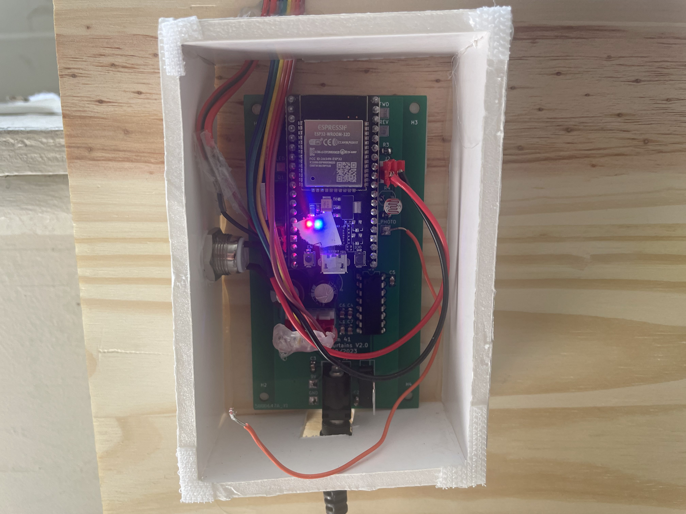

# Max Worklog

# Table of Contents
- [2023-02-07 - Proposal TA Meeting](#2023-02-07---proposal-ta-meeting)
- [2023-02-15 - TA Meeting](#2023-02-15---ta-meeting)
- [2023-02-20 - Team Work](#2023-02-20---team-work)
- [2023-02-22 - TA Meeting](#2023-02-22---ta-meeting)
- [2023-02-22 - Individual Work](#2023-02-22---individual-work)
- [2023-02-27 - Head TA Notes](#2023-02-27---head-ta-notes)
- [2023-03-06 - Max and Jack Work](#2023-03-06---max-and-jack-work)
- [2023-03-08 - TA Meeting](#2023-03-08---ta-meeting)
- [2023-03-27 - Testing Parts](#2023-03-27---testing-parts)
- [2023-04-04 - Testing Parts](#2023-04-04---testing-parts)
- [2023-04-12/13/14 - Testing Second Round PCB pt.1](#2023-04-12-13-14---testing-second-round-pcb-pt1)
- [2023-04-15 - Testing Bread board pt 1.](#2023-04-15---testing-bread-board-pt-1)
- [2023-04-16 - Testing Bread board pt 2.](#2023-04-16---testing-bread-board-pt-2)
- [2023-04-17 - Testing Bread board pt 3.](#2023-04-17---testing-bread-board-pt-3)
- [2023-04-19 - TA Mock Demo](#2023-04-19---ta-mock-demo)
- [2023-04-24 - Final PCB Arrives](#2023-04-24---final-pcb-arrives)
- [2023-04-25 - Pre Demo Testing](#2023-04-25---pre-demo-testing)

# 2023-02-07 - Proposal TA Meeting
-   It was suggested that voltages be put on block diagrams to ensure clarity in the design process.
-   Research on the HomeKit chip was discussed. A chip was needed that supports WIFI, HomeKit, and has enough I/O ports for other subsystems.
-   It was noted that we needed to determine the number of I/O ports that would be needed for the project.
-   It was emphasized that the chip should be given the correct power to avoid any potential issues.
-   Safety and tolerance analysis were discussed for proposal.
-   It was suggested that circuit diagrams should be started to provide a more detailed look at the system.
-  Need to get proposal submitted
-  Meet weekly Wednesday from 2-3pm

# 2023-02-15 - TA Meeting

  

-   The need to have a capable micro controller on the PCB for the new project was emphasized.
-   It was suggested that motor controllers be included on the same PCB.
-   The motor controllers could be controlled by the processor on the same PCB.
-   A photoresistor was suggested as an input for the microcontroller to allow the system to react to changes in the surrounding environment.
-   The microcontroller's output could be connected to an LED driver to provide visual feedback to the user.
- Need to decide on using Lipo battery or wall plug in for power. Leaning toward battery for portability
- PCB can be 100 x 100 mm
- Need to pick out micro controller (MAKE SURE IT HAS ENOUGH INPUT/OUTPUT PINS)
- Get moving on the design doc, need to make block diagram more specific.

  
# 2023-02-20 - Team Work
- Got parts picked out for motor, motor controller, blinds
- Need to decide if encoder is needed for functionality
- How many pins would encoder add?
- Finished R&V Tables

## Design Doc Todo List
- Circuit Diagrams
- Labor costs
- Time Table
- Hardware design choices
- Software design choices
- Physical design schematics

# 2023-02-22 - TA Meeting

  
-   The revised proposal must be submitted by Thursday.
-   It was suggested to label the lines on the block diagram to improve readability.
-   More quantitative requirements are needed for the project.
-   The ESP8266 was chosen as the microcontroller because Jack found some laying around. They have wifi capabilities. Max will test them out
-   Footprints for the components need to be found, and the PCB layout needs to be designed.
-   Only orders through Digikey will be accepted, no orders through Walmart or Amazon.
-   Jack will get the PCB reviewed on Monday.

## Todo list
-   Submit the revised proposal by Thursday.
-   Label the lines on the block diagram for improved readability.
-   Develop more quantitative requirements for the project.
-   Find footprints for the components and design the PCB layout.
-   Submit part orders through Digikey.
-   Jack to get the PCB reviewed on Monday.
  
# 2023-02-22 - Individual Work
- Worked on design doc
- Decided to switch to outlet for 9v power instead of Lipo battery for simplicity (team decision)
- Got ESP8266 to flash correctly
	- Need to download [drivers](https://cityos-air.readme.io/docs/1-usb-drivers-for-nodemcu-v10) to do so FYI
- Got ESP8266 to connect to local network
- Got basic Apple HomeKit LED to work using this [library](https://github.com/Mixiaoxiao/Arduino-HomeKit-ESP8266) and the on board LED

## Todo List
- Finish up design doc
	- Cost
	- Hardware Decisions
	- Formatting (Vinay) 
- Start Team contract

# 2023-02-27 - Head TA Notes

- Switch from ESP8266 to [ESP32](https://www.espressif.com/en/products/modules/esp32) for more pins
 - Generate [PWM](https://randomnerdtutorials.com/esp32-pwm-arduino-ide/) using software with ESP32 instead of hardware
 - ESP32 should have dedicated pins for this
 - Figure out pins for programming ESP32 (Jack + Max)
 - Design usb to uart for programming (Jack)
 - Can't use dev kit for ESP32, need to make diagram for the chip and programmer
 - Make sure we add test points to PCB
 - Don't need 5V line anymore so need to find 9V LED strip instead (Vinay)
  
# 2023-03-06 - Max and Jack Work
- Jack finished circuit diagrams
- Finished laying out PCB together
- Got errors with DRC, clearance violations mostly from small pads close together
- Fixed clearance by modifying clearance constraints for those parts specifically
- Also can't fit thick tracers into some small pads because too close together
- Might have trouble soldering small pads, will see when parts arrive
- Jack will put PCB order in tonight
- Need to design enclosure for PCB (Vinay)

## Todo List
- Teammate Evaluation
- Get part order in
- Wait for PCB...
# 2023-03-08 - TA Meeting
- Space out our PCB board more, no need to optimize yet
- Maybe use 6 pin connector to program instead of USB?
- Put resistors horizontal and capacitors vertical
- Design Doc regrade due 3/24
- Check current ratings for motor
- Might need different motor controller for sake of soldering

# 2023-03-27 - Testing Parts
- Built frame and physical board for curtain and got it mounted (Vinay)
- Tested LED strip with 9V
- PCB not functional, need to wait for second round to test

# 2023-04-04 - Testing Parts

- LED MOSFET test is failure, 5V signal won't cause MOSFET to drain power to LED
- Maybe a bad MOSFET?
- Need to reexamine MOSFET circuit
- Motor turns with minimum 5V directly from power supply
- Able to generate digital signals from ESP8266 successfully.
- Able to read [analog signal](https://docs.espressif.com/projects/esp-idf/en/v4.4/esp32/api-reference/peripherals/adc.html#:~:text=The%20ESP32%20ADCs%20can%20measure,being%20input%20to%20the%20ADCs.) from ESP8266 successfully with generated signal.
- May have broke ESP8266, too much power into input pin

# 2023-04-12/13/14 - Testing Second Round PCB pt.1
## 04/12
- 3d printed motor shaft connector arrived
- Mounted motor onto board (Vinay) 

- ESP32 soldered chip on PCB not working, bad connections?
	- Added solder to power connection and now seems to be getting power, unable to program though.
	- Pins for flashing not soldered well, non responsive ESP32
- Photo resistor voltage not changing, stays constant no matter the lighting
	- Need to change resistor values, test on bread board
- Motor controller test is a failure, voltage reading across FWD and REV but no motor turn.
- MOSFET circuit for LED also not working, when gate is high still no voltage across the LEDs.
	- Common drain vs Common source? Try changing to common drain on bread board.
- Plan to use ESP8266 and breadboard for demo, get working on breadboard.

## 04/13
- Fixed LED MOSFET circuit on breadboard, use [common drain](https://en.wikipedia.org/wiki/Common_drain) schematic
- MOSFET gives LED power when gate is low.
- Motor controller schematic wrong? Find difference between VDD, VM and VGS.
- Should VGS be 9V too?
- Documentation of motor controller unclear, going to try different motor controller on bread board
## 04/14
- Made photoresistor circuit on breadboard
- Got circuit working using 3.3 K&#937; for resistor value
- Range of 0.37 V - 1.94 V across the photoresistor for low to high levels of light
- Able to read analog value from photoresistor with ESP8266 using [ADC](https://esp32io.com/tutorials/esp32-light-sensor), gives a value from 0-1023 in the code.
- Button circuit works on bread board and can be read through the ESP8266
- Think we burned out ESP8266
- Switched to [L293D](https://lastminuteengineers.com/l293d-dc-motor-arduino-tutorial/) motor controller... had one from previous class
- L293D motor controller works on breadboard (Jack)
- Jack will put circuit together with all components on bread board to test with blinds for tomorrow

# 2023-04-15 - Testing Bread board pt 1.

-	Connected bread board to mounted motor
-	Able to drive motor using basic code
	-	Need to test PWM generation from ESP8266
-	Motor able to lift blinds but getting froze up sometimes
-	Switched to PWM and cut weight off bottom of the curtain
	-	Taped quarters to bottom to pull blinds down
-	Motor now able to raise and lower curtain
-	Able to read encoder in ESP32 console
-	Test button input
	-	Button input works but need to write logic to read in value and store it before button is [unpressed](https://esp32io.com/tutorials/esp32-button)
	-	Finished method for reading button to toggle global Boolean when button is pressed

# 2023-04-16 - Testing Bread board pt 2.
- Need to test reading photoresistor input
	- Unable to read photoresistor, logging all 0s, Software or hardware problem?
	- Used multimeter to check voltage across photoresistor, hardware is fine.
- Using wrong port to read in photoresistor, can't use ADC channel 2 pins because they are used for [wifi capabilities](https://github.com/espressif/arduino-esp32/issues/440)
- Switched to ADC channel 1 port, successfully able to read photoresistor value into code.
- LED strip able to turn on using digital signal, need to find light threshold for photoresistor.
- ESP32 stopped working..... amazon order in bound
- Team decided to order our own PCB from a separate website using ESP32 DevKit instead to have functioning PCB by the demo, unable to solder and test ESP32 chip in time.
# 2023-04-17 - Testing Bread board pt 3.
- Found lighting range for photoresistor, should turn lights on around 300 (0-1023). May need to change depending on the setting for demo
- Need to combine all of the testing code and test Apple HomeKit
- Unable to use same library as testing for Apple HomeKit because we switched to ESP32 instead of ESP8266.
	- Using [this](https://github.com/Yurik72/ESPHap) library instead, will have to retest
	- Able to create a basic Apple HomeKit device again similar to the first test... Now apply to my current code
	- Created basic smart window blind device, reads 0-100% into code when slider is adjusted
- Combined testing code with Apple HomeKit Code, need to create method to move motor based on the 0-100% input
	- Found encoder bounds for lowering and raising the curtains, will start curtains in the open position to be encoder 0 point. Lowering the curtains will reach an encoder value of -900. 
	- Encoder value: 0 = OPEN
	- Encoder value: -900 = CLOSED
- Created method to rotate to a given position and then stop.
	- Will feed the method Input Percentage * -900 to calculate position to rotate to.
- Rotate method works with test values, now will test with values read in from Apple HomeKit
	- Method WORKS!!! Responds to the users input and rotates to correct position, then stops.
- Need to add logic to turn on LED when curtains are open and photoresistor value < threshold.
	- Logic added and works, LED only turns on when encoder value $\approx$ 0 and photoresitor value $\leq$ 300.
- Added edge case logic for button to figure out whether to rotate to open or close depending on the current state.
- Tested connecting and controlling using test router, and WORKS!! 
- Breadboard testing finished, code is fully functioning for mock demo.
- Also tested alarm home automation, and it also worked!
- Now just waiting for new PCB to come in.

# 2023-04-19 - TA Mock Demo
- Have a good introduction
- Practice demo beforehand
- Use alarm as demonstration for functionality
- Problems faced, solutions, R&V tables for subsystems

# 2023-04-24 - Final PCB Arrives
- Jack soldered components onto PCB, just need to flash ESP32 board and test
- Testing PCB
	- Everything fully functioning except for photoresistor circuit. 
	- Same mistake as before, need to use ADC channel 1 instead of channel 2
- Changed input pin for photoresistor and values are now being read in!
- PCB FULLY FUNCTIONING!!
## Final Todo List
- Crimp wire connectors
- Mount PCB on Board
- Assemble PCB enclosure
# 2023-04-25 - Pre Demo Testing
- Mounted PCB onto board
- Assembled PCB enclosure using hot glue and board cut outs
- Crimped wires for connectors
	- Had to add hot glue to motor connector to keep wires in place
- Photoresistor readings stopped working, did we burn ESP32?
	- Voltage still correct across photoresistor, must be ESP32 problem
	- Replaced ESP32 with new one, fixed the problem
- Need to adjust LED light threshold for activation, lab is much brighter than testing room
	- Changed lighting threshold from $\leq$ 300 to $\leq$ 500 to power on LED.
- PROJECT DONE!
- Final board:

