# Vinay's Notes

## Contents

- [2/6/2023](#project-proposal-notes)
- [2/13/2023](#design-doc-meeting-notes)
- [2/27/2023](#design-review-notes)
- [3/8/2023](#post-design-review-notes)
- [3/27/2023](#demo-board-design-notes)
- [4/3/2023](#3d-printing-motor-part)
- [4/12/2023](#2nd-round-pcb-test)
- [4/13/2023](#breadboarding-circuit-and-programming-microcontroller)
- [4/16/2023](#testing-and-verification)
- [4/19/2023](#mock-demo)
- [4/24/2023](#pcb-integration-and-final-demo)
- [4/27/2023](#mock-presentation)

## Project Proposal Notes
List of ideas that we have brainstormed:
- Smart Fridge
- Smart Mailbox
- Smart Humidifier
- Cooler that follows you
- Guitar Amp
- Auto inflating tire system
- object following camera stand
- Smart tv remote
- Guitar Auto Tuner
- Smart Stove
- Smart Curtains/blinds
- Auto Gear Shifter for Bicycle
- Smart Speaker System

The idea we decided on doing is "Cooler that follows you". Essentially a cooler that tracks its owner while moving on a cart. It also cools its drinks and tells owner when the cooler is at capacity

UPDATE: The "Cooler that follows you" idea got shut down by TA after doing initial rough proposal. We initially thought we could use an Arduino but the professor said it is not allowed and we must use a microprocessor on a PCB. The professor explained it would be too complicated to get the cooler to follow the owner with any resemeblance of a self driving cart. 

UPDATE: We are now pivoting to "Smart Curtains". Our initial proposal involves implementing a curtain that can open and close with a motor and can be controlled over wifi via HomeKit.

UPDATE: Smart Curtains got **approved** by TA under one condition: that we add a feature where we can detect the brightness level outside the window and if it is too dark (e.g. it's winter, cloudy, etc.) our system should include a string of LEDs around the window that will illuminate to provide more light.

Some initial sketches of our Smart Curtains Project:

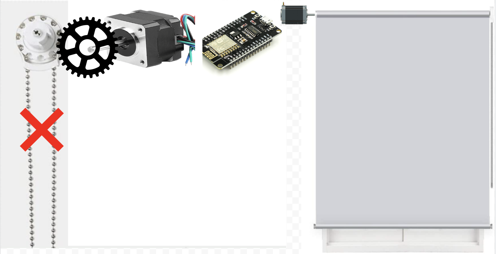
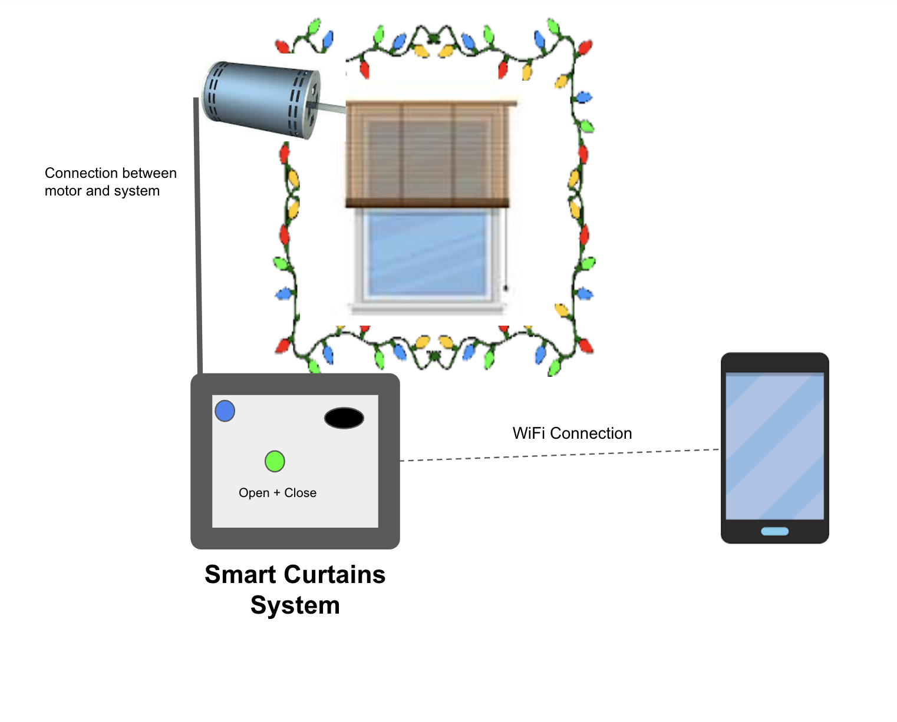

## Design Doc Meeting Notes
For the design doc on top of the proposal we need to add:
- R & V Tables
- Circuit Diagrams
- Labor costs
- Part Costs
- Grand total cost
- Time Table/Schedule
- Hardware Design Choices Blurb
- Software Design Choices Blurb
- Make block diagram more specific (from TA)
- Physical Design Blurb and Physical Design CAD

My job: 
- R&V Tables
- Labor Costs
- Part Costs
- Overleaf Formatting
- Time Table/Scheduling
- Physical Design Blurb
- Physical Design CAD

Software using for CAD: Tinkerblocks

UPDATE: Tinkerblocks is a very tedious software. Similar to scratch programming but for CAD. Switching to a better software.

UPDATE: CAD is done. Using gear system is TBD based on if we get a motor with high torque.

UPDATE: Switching to 9V circuit wall mount instead of battery powered LiPo 5V circuit. The heavier components of our circuit are more common in 9V+ so it makes more sense.

UPDATE: We have decided to use ESP8266 as our microcontroller chip.

Some Images of Physical Design CAD:
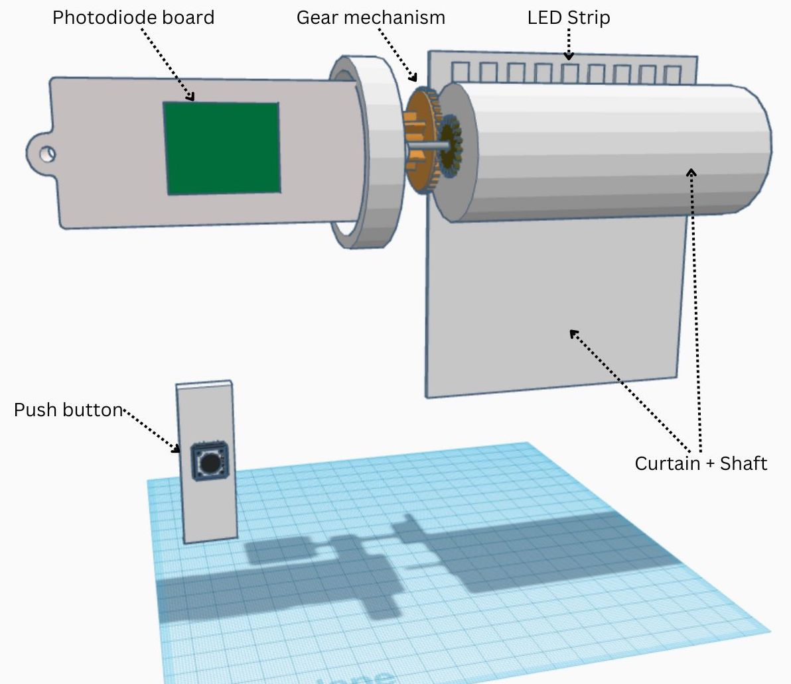
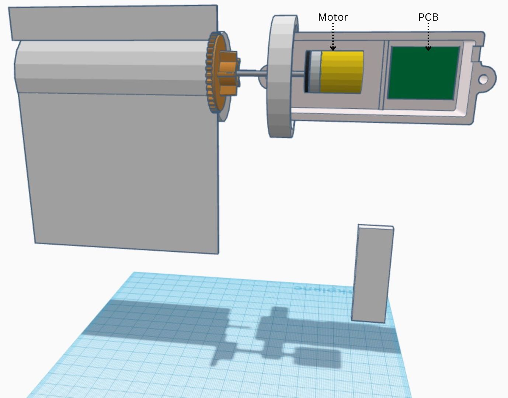

## Design Review Notes

Note: 100mmx100mm PCB is the max size pcb we can order

Note: make sure to take a look at the CHARM System design doc for reference (from TA)

Note: Keep in mind the sound of the motor when curtain moves up and down. If the purpose of the smart blind is to wake someone up with natural light as opposed to a loud alarm, then make sure the motor itself doesnt make enough sound to wake someone up.

Note: Make block diagram even more detailed. Have lines be specific and change color code to Labeled lines. Keep a legend for the lines as well.

Note: Cannot add things ordered from Amazon to budget. They will have to be out of pocket. Only things that can be on the school budget are Digikey orders and PCB orders.

## Post Design Review Notes

These are the notes right before our first PCB order

Note: Space out connectors on PCB board

Note: Space out microcontroller

Note: Check orientation of resistors and capicitors

Note: Order digikey parts soon and double the amount of parts for spares

Note: Check current of motor so that it doesn't reset pins

Note: Get motor with encoder down the road to make curtain movement more precise.

Note: (TWEAKS TO DESIGN DOC) Safety concerns other than privacy. Add thermal safety blurb. Be aware of noise of motor.

Note: Replace brightness with "ambient" bigness or "indoor" brightness

Note: Swap out controller and check it doesn't overcurrent the motor. Then test with a motor.

Note: Separate pcb and motor enclosure for simplicity and safety.

Note: Look into buying lightweight curtain material.

UPDATE: We are switching from ESP8266 to ESP32 for more pins

Note: We can generate PWM with code, no need for hardware.

Note: We can't use the devkit ESP32.

## Demo Board Design Notes

Quick Lowe's Run in preparation for assembling the board:
- Hot glue gun
- M3-.50x6 screws
- Flat washers #8
- Flat Phillips with Nuts #8-32 x 1/2 in
- Box Nails 4D X 1 1/2"
- Nuts #8-32
- 8 inch Assorted Cable ties
- foam boards 8 pcs

Note: window roller has arrived, will begin testing a demo setup.

Note: Idea for demo board assembly; I am going to use a 3x2.5 foot wood board for the curtain mount.

Note: I need something that will hold the curtain up and let it hang from the top.

Note: I decided to use a metal L piece with holes in it for mounting the curtain with screws.

Note: This idea works but I am struggling to attach the L piece to the thick wood piece I bought without a Drill!

Note: I am going to hammer but itll take me a while.

UPDATE: Everything is attached and looks pretty good! The excess nail poking out the back of the board I have bent into board and hotglued to the board for safety purposes.

The following is an image of the setup:

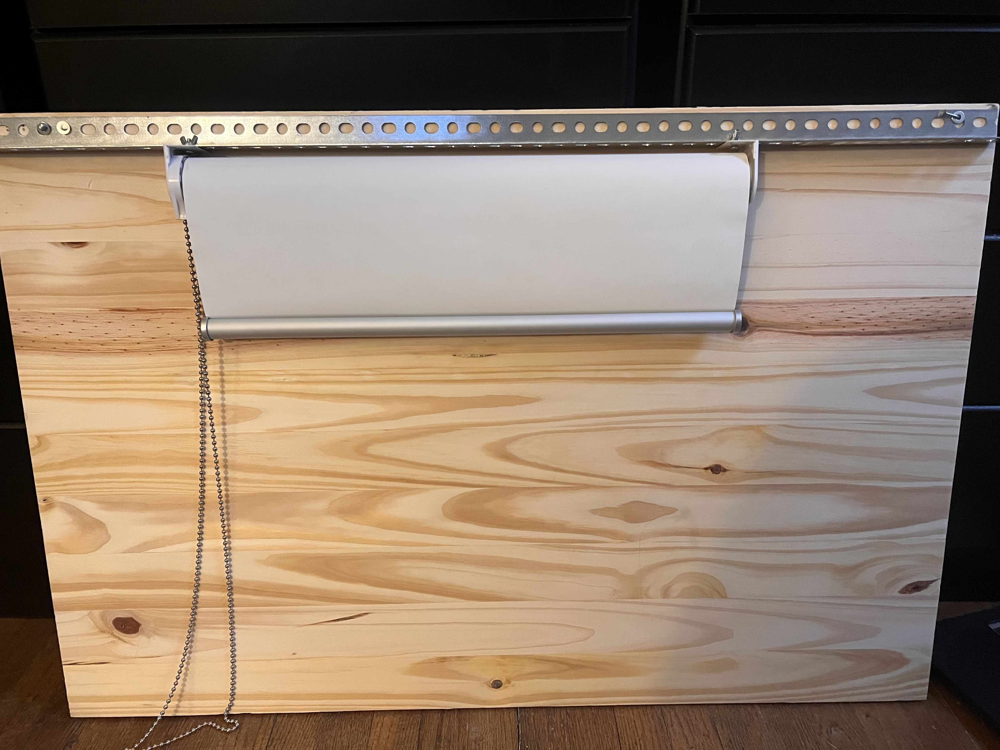

Note: Other stuff accomplished with Max include: testing LED strip with 9V. 

The following is an image of testing LEDS:

Note: Unfortunately PCB is not working gotta wait for next round.

## 3D Printing Motor Part Notes

Note: Spent the day at Lowes trying to figure out a way to get the motor to spin the curtain through the curtains gear hole. Couldn't come up with anything so I will have to CAD and 3d print a part for it.

Note: Side quest, we are testing more parts. We are supposed to get our next PCB order since the first one didnt work. We have decided in the meantime lets Breadboard an LED circuit!

Note: breadboard task failed... For some reason the 5V signal wont cause MOSFET Drain to power the LED. 

Note: LED is just flickering and not actually switching with correct logic using the ESP8266 as a testing devkit.

Note: We figure the MOSFET is faulty. We will test BJT next.

Note: BJT works for a moment then stopped working. I think the board is fried.

UPDATE: 3d printed part has arrived. I ordered 9 of them since the measurements were very small and I couldn't run the risk of having the printer glitch and be slightly off.

Note: Used a #8-32 Nut and attached one of the pieces to the motor after clearing all the plastic gunk that was still in the hole.

Note: Part fits pretty well into the gear hole and effectively rolls/unrolls the curtain just by twisting the curtain with the motor manually.

Note: The motors static friction is surprisingly strong and can hold the curtain up pretty well.

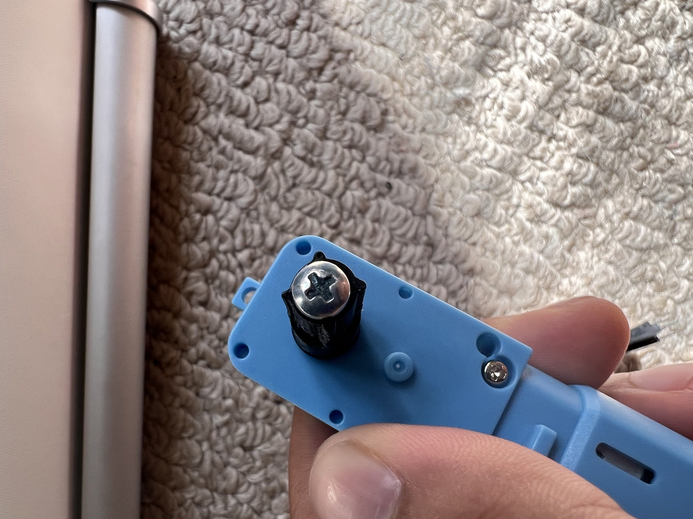
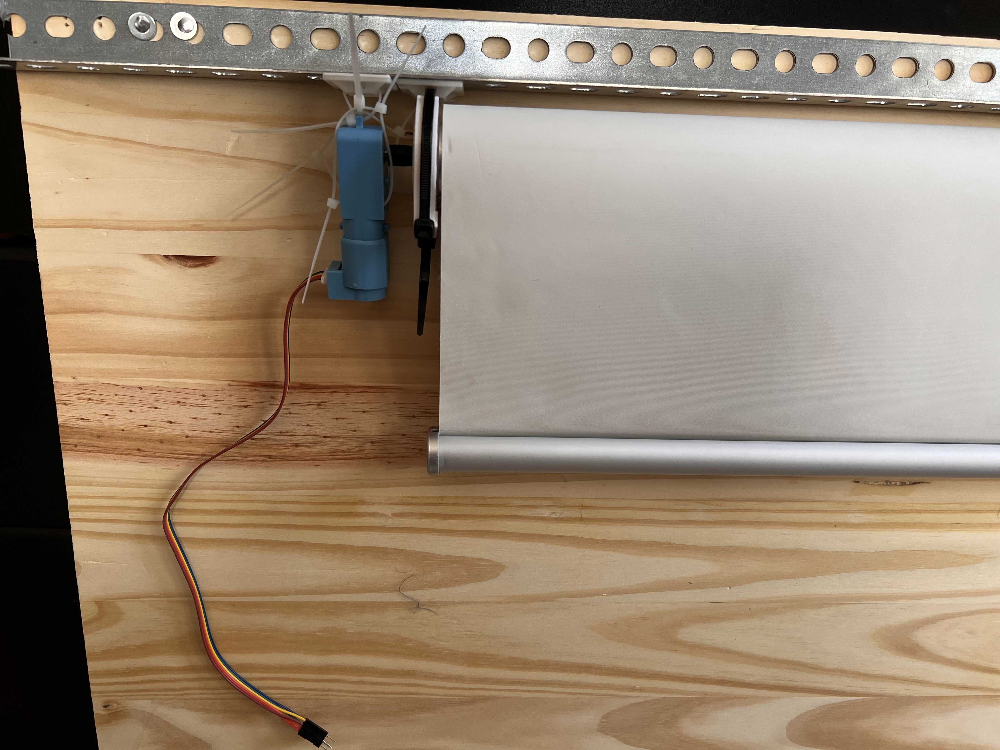

## 2nd round PCB test

Note: ESP32 soldered chip on PCB not working, possible bad connections?

Note: Added solder to power connection and now receiving power, but unable to program!

Note: Pins for flashing not soldered well, resulting in non-responsive ESP32

Note: Photo resistor voltage remains constant, regardless of lighting

Note: Need to change resistor values and test on breadboard

Note: Motor controller test unsuccessful, voltage reading across FWD and REV but no motor turn

Note: MOSFET circuit for LED not working, even when gate is high

Note: Consider switching from common source to common drain on breadboard

Note: New plan is to use ESP8266 and breadboard for demo, aim to get it working on breadboard.

## Breadboarding Circuit and Programming Microcontroller

Note: We redid the LED MOSFET circuit from scratch on the breadboard with a true 9V source as well. It worked using the common drain schematic.

Note: We are excited that the LED circuit works powering it with 2nd round PCB barrel jack piece. We will now try salvaging the motor controller on the PCB.

Note: Unfortunately its not working even though we are getting the right voltages at individual testpoints.

Note: Look like we will have to scrap this PCB. The motor controller datasheet is confusing. Im going to order another motor controller ASAP. The L293D through hole mount looks good (Half-H Drivers).

Note: Jack got the photoresistor circuit to work on the breadboard. Thats good progress

Note: We are playing aroud with resistor values at the moment. Seems like 3.3 kilo ohms is the optimal value for it. We get a nice large range of 1.94V - 0.37V for uncovered to fully covered photoresistor respectively.

Note: Testing the serial monitor output from the photoresistor value also seems to work.

Note: Button circuit was simple according to Jack. He fixed it up really quick and we were able to test it instantly. Works perfect.

Note: L293D motor controller works! We picked up the order today and it was much simpler to follow.

Note: Was able to test with manual power but not necessarily with the ESP8266 yet. We will breadboard everything tomorrow and do a full day of testing.

## Testing and Verification
Note: Breadboard is now fully assembled now we are testing if it works.

Note: It drives the motor however the weight at the bottom of the curtain is too heavy. We cut it off and taped 3 quarters to the bottom curtain to maintain a decent amount of the weight to reduce slack

Note: Changed PWM to max drive. When it unwinds it goes faster than when it winds the curtain up. Lets change the PWM so it goes at relatively the same speed both up and down.

Note: Button test works and moves motor up and down.

Note: Testing the photoresistor part of circuit is buggy. Used multimeter to see if photoresistor was working and verified it was.

Note: we found out our pin wasnt reading the signal. Seems like it could either being forced low or high. Or the pin was blownout?

Note: we switched to a different pin and it worked. Found out the previous pin was ADC channel 2 which, when the chip uses WIFI, cannot be used for reading inputs.

Note: ESP was lighting the LEDS for a bit but then I think we powered a bad pin. Getting brownout error in serial console. We gotta order a lot more devkits this keeps happening.

Note: New one on the way.

Note: Next Day and we have the new ESP32. Light circuit full works. Next thing to do is create wifi automation code.

Note: We had an existing homekit codebase for the ESP8266 that worked but with ESP32 the code is a little more confusing.

Note: we were able to do some digging and found and opensource code for Apple homekit motor control. Allows us to open and close the curtain from a 0% open position to a 100% open position. 

Note: Wrote some extra logic for the manual button to turn the curtain to certain position based on the percentage of openness the curtain is set at by the homekit software.

Note: We added logic to the LED such that when the curtain is closed, there should be no additional LED light even if there is not enough light in the room. When the curtain is closed we assume the user wants the lights to be off.

Note: Final test is to make sure all this wifi stuff works over a local network for Demo purposes (since we cant connect external devices to IllinoisNet), we use Jacks router and it work!

Note: Testing Alarm home automation also works as well!.

Note: Last Steps are to get the final PCB order that is based on our new breadboard and build a clean Demo setup. Also collect data on a spreadsheet for our Testing and Verification stuff.

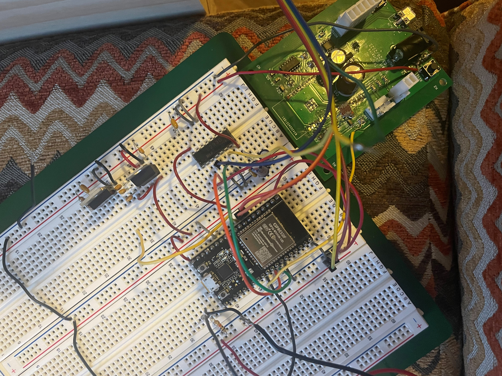

## Mock Demo

Note: Have a technical introduction

Note: go through demo prior to final demo

Note: Use the alarm to demonstrate the coolest feature of the product

Note: Show the challenges and demonstrate the difficulty of building the product.

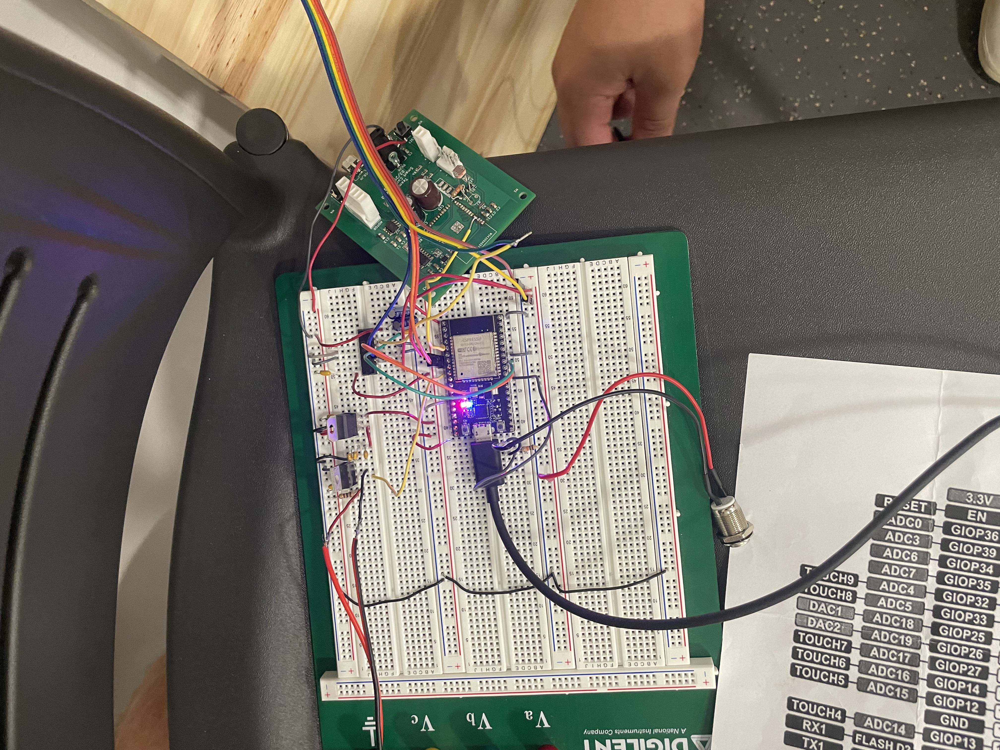

## PCB Integration and Final Demo

Note: PCB has arrived. We tested everything and it works. Eureka! We also made sure to collect all our data and make sure all the requirements have been met.

Note: Used foam boards to cut out a compartment for the pcb housing

Note: cut out wire holes on either side of the box.

Note: used velcro pads to mount the PCB to the board

Note: hotglued everything else to the board

Note: used electrical tape to seal up exposed wire

Note: Ziptied motor to secure to the board.

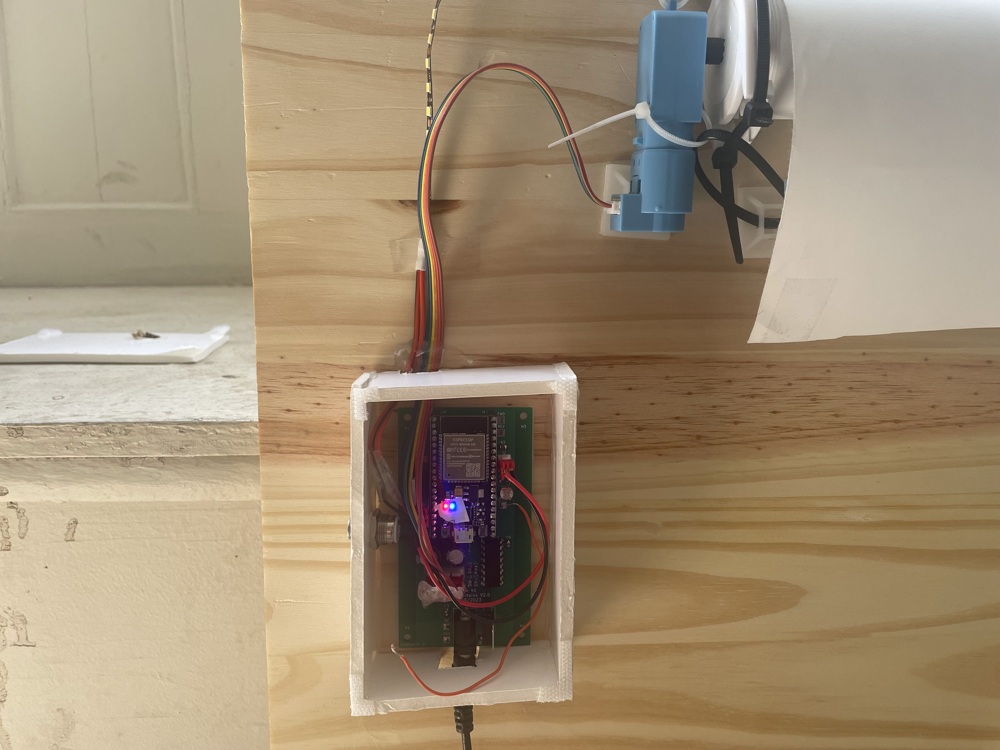

## Mock Presentation

Note: These were some of the feedback we wrote down/recieved for our presentation:
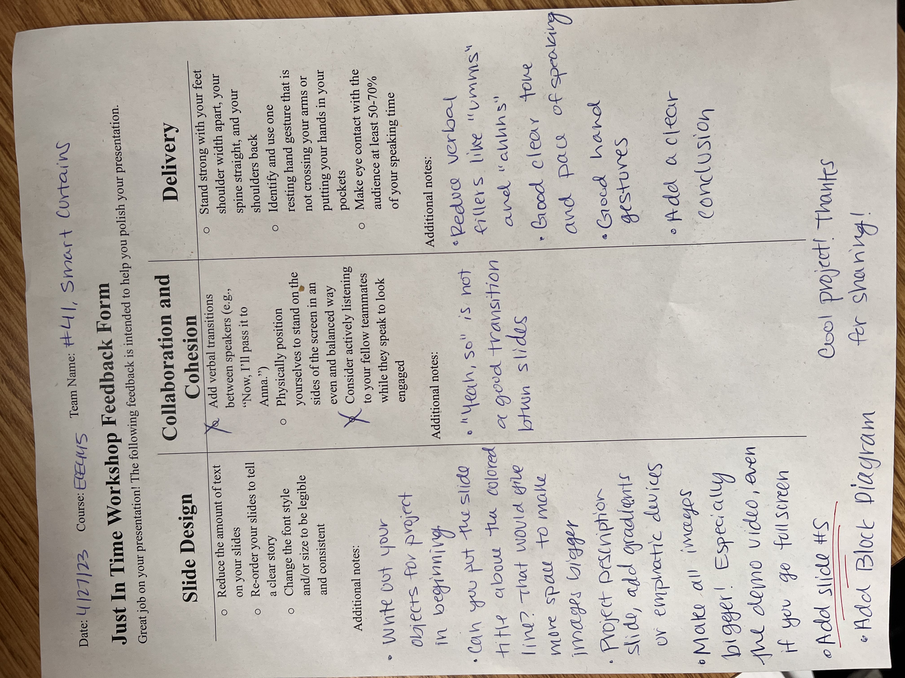
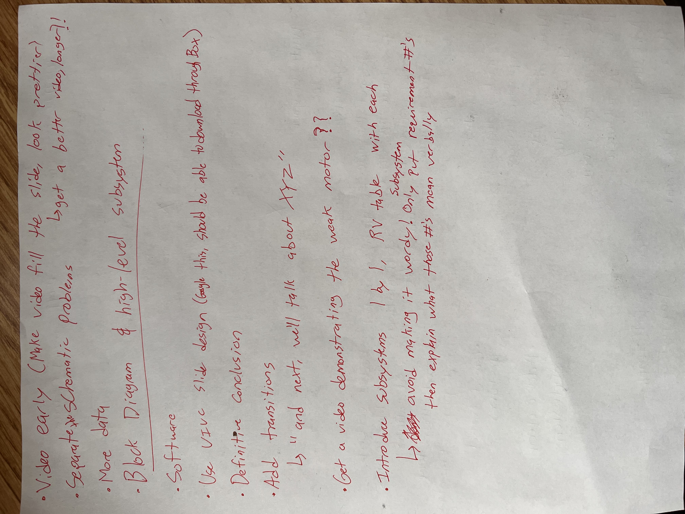

